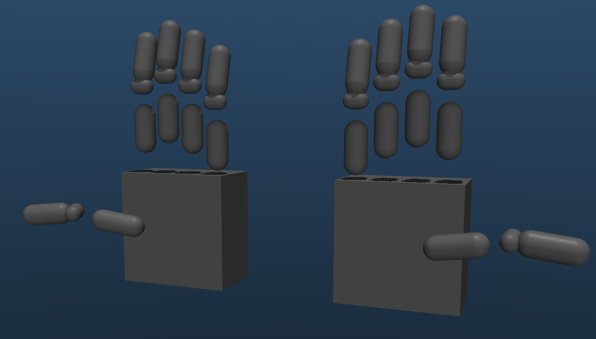

# DexRobot MuJoCo

MuJoCo binding for DexRobot, providing simulation and visualization capabilities. This package creates a ROS node (compatible with both ROS1 and ROS2) that receives joint state messages and simulates them in MuJoCo.

## Models

### URDF Conversion and Configuration

The hand models are converted from URDF format to MJCF (MuJoCo) format. The conversion process includes:

- Automatic position actuator creation for each joint
- Configuration of actuator parameters (PID gains, force limits etc.)
- Addition of sites at fingertips for visualizing and sensing
- Addition of touch sensors using the fingertip sites
- Wrapping everything under a base link for floating base simulation

### Collision Model Simplification

The original mesh-based collision model is simplified to use primitive geometries (boxes and capsules), significantly improving simulation performance. The simplified collision model is defined in YAML files under `models/collision_geoms/`.

| |  |
|---------------------------------------------|---------------------------------------------|
| Visual model                                 | Simplified model for collision                        |

Left: Original full mesh-based collision geometries. Right: Simplified collision geometries using primitives.

### Scenes

A simple scene, adapted from [RoboHive](https://github.com/vikashplus/robohive), is provided in `dexrobot_mujoco/scenes/box.xml`. Users can easily create new scenes using the DexHand model and the assets provided in `dexrobot_mujoco/scenes/{furniture,scene}_sim`.

## ROS Node

The package provides a ROS node that works with both ROS1 and ROS2 (auto-detected at runtime). The node supports:
- Joint state control of the hand
- 6-DoF floating base control
- Joint state feedback
- Touch sensor feedback
- Recording to CSV/MP4/ROS bag
- VR stereo visualization

### Topics

| Name | Direction | Type | Description |
|------|-----------|------|-------------|
| `joint_commands` | Input | `sensor_msgs/JointState` | Commands for hand joints |
| `hand_pose` | Input | `geometry_msgs/Pose` | Floating base pose (when enabled) |
| `joint_states` | Output | `sensor_msgs/JointState` | Current joint positions and velocities |
| `body_poses` | Output | `geometry_msgs/PoseArray` | 6-DoF poses of tracked bodies |
| `touch_sensors` | Output | `std_msgs/Float32MultiArray` | Touch sensor readings |

### Services

| Name | Type | Description |
|------|------|-------------|
| `save_screenshot` | `std_srvs/Trigger` | Save current viewer frame as image |

### Example usage

```bash
python nodes/dexrobot_mujoco_ros.py dexrobot_mujoco/models/dexhand021_left_simplified.xml     # Simulate a single hand

python nodes/dexrobot_mujoco_ros.py dexrobot_mujoco/scenes/box.xml --config config/scene_default.yaml    # Simulate a scene, with camera and ros topic configurations specified in the config file
```

## Utilities

The package includes utility modules for working with MuJoCo:
- `mjcf_utils.py`: Functions for manipulating MJCF XML files
- `mj_control_utils.py`: Wrapper classes for MuJoCo simulation and control

Refer to source code for detailed documentation.

## License

Copyright 2024 DexRobot

Licensed under the Apache License, Version 2.0 (the "License");
you may not use this file except in compliance with the License.
You may obtain a copy of the License at

    http://www.apache.org/licenses/LICENSE-2.0

Unless required by applicable law or agreed to in writing, software
distributed under the License is distributed on an "AS IS" BASIS,
WITHOUT WARRANTIES OR CONDITIONS OF ANY KIND, either express or implied.
See the License for the specific language governing permissions and
limitations under the License.
