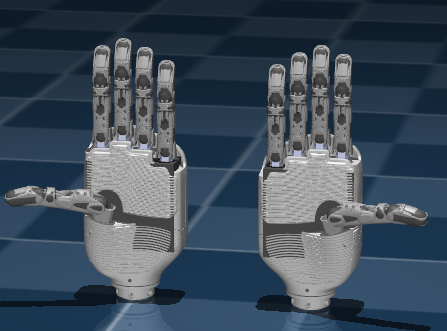

# DexRobot MuJoCo

[English](README.md) | [中文](README_zh.md)

DexHand 灵巧手的 MuJoCo 仿真环境，集成 ROS 支持，提供以下功能：

- 带优化碰撞模型的灵巧手仿真
- 机械臂集成支持
- 可自由组合的场景和家具环境
- 兼容 ROS1/ROS2
- VR 可视化

## 安装

```bash
pip install -e .
```

## 灵巧手模型

可用的灵巧手模型：

```bash
# 右手（完整碰撞模型）
python nodes/dexrobot_mujoco_ros.py dexrobot_mujoco/models/dexhand021_right.xml

# 右手（简化碰撞模型 - 更快）
python nodes/dexrobot_mujoco_ros.py dexrobot_mujoco/models/dexhand021_right_simplified.xml

# 左手
python nodes/dexrobot_mujoco_ros.py dexrobot_mujoco/models/dexhand021_left.xml
python nodes/dexrobot_mujoco_ros.py dexrobot_mujoco/models/dexhand021_left_simplified.xml

# 浮动基座的手
python nodes/dexrobot_mujoco_ros.py dexrobot_mujoco/models/dexhand021_right_floating.xml

# 安装在机械臂上的手
python nodes/dexrobot_mujoco_ros.py dexrobot_mujoco/models/dexhand021_right_jaka_zu7.xml
```

简化的碰撞模型在保持准确性的同时显著提高了仿真性能：



## 场景组合

创建一个接球场景：

```bash
python nodes/dexrobot_mujoco_ros.py dexrobot_mujoco/scenes/ball_catching.xml --config config/ball_catching.yaml
```

在 YAML 中配置初始位置和跟踪对象：

```yaml
camera:
  azimuth: -180
  distance: 2.5
  elevation: -25
  lookat: [0.0, 0.0, 0.55]

initial_qpos_freejoint:
  ball_joint: [2.0, -0.2, 0.0, 1.0, 0.0, 0.0, 0.0]

initial_qvel_freejoint:
  ball_joint: [-4.1, 0.0, 4.1, 0.0, 0.0, 0.0]
```

## ROS 接口

使用标准 ROS 消息控制关节：

```python
from sensor_msgs.msg import JointState

# 发布关节指令
msg = JointState()
msg.name = ['r_f_joint1_1']
msg.position = [0.5]
publisher.publish(msg)
```

支持多种格式的数据记录：

```bash
python nodes/dexrobot_mujoco_ros.py model.xml \
    --output-formats ros csv mp4 \
    --output-csv-path data.csv \
    --output-mp4-path video.mp4 \
    --output-bag-path recording.bag
```

## 文档

详细信息请参阅 `docs/` 目录下的完整文档：

- 入门指南
- 灵巧手模型与配置
- 场景创建
- ROS 集成
- API 参考

## 许可证

Copyright 2024 DexRobot. 基于 Apache License 2.0 授权。
