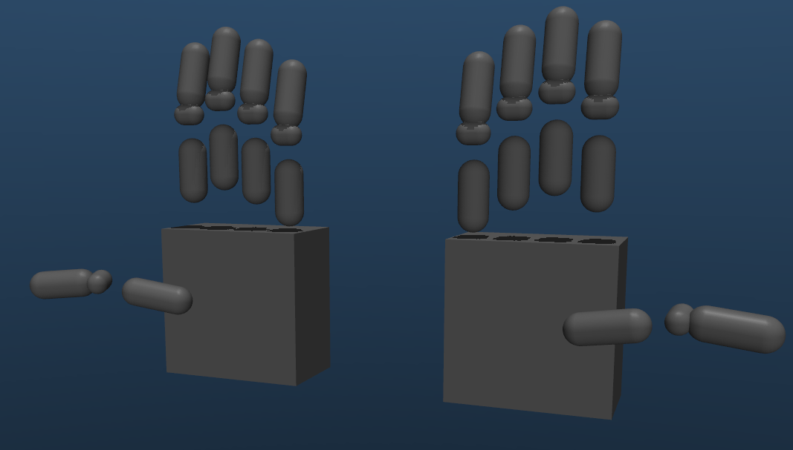

=============
Hand Models
=============

This section covers everything related to the DexHand models in MuJoCo, from model conversion to configuration and usage.

   Left: Original full mesh-based collision geometries. Right: Simplified collision geometries using primitives.

.. toctree::
   :maxdepth: 2
   :caption: Contents

   conversion
   collision_models
   components
   articulation
   examples

Overview
--------

The DexHand models in MuJoCo are created through a systematic process that involves:

1. Converting URDF models to MJCF format
2. Optimizing collision geometries
3. Configuring actuator properties
4. Adding sensors and sites
5. Setting up articulation capabilities

Model Structure
--------------

Core Components
^^^^^^^^^^^^^
- **Base Link**: Provides anchor point for floating base or robot arm attachment
- **Finger Links**: 5 fingers with multiple joints each
- **Palm Links**: Structural components of the palm
- **Sites**: Points of interest for sensors and visualization
- **Actuators**: Position-controlled joints with configurable parameters
- **Sensors**: Touch sensors at fingertips
- **Collision Geometries**: Simplified or full mesh-based
- **Touch Sensors**: MuJoCo native or TaShan 11-dimensional sensors

Available Models
^^^^^^^^^^^^^
- **dexhand021_right.xml**: Right hand with full collision meshes
- **dexhand021_left.xml**: Left hand with full collision meshes
- **dexhand021_right_simplified.xml**: Right hand with optimized collision geometries
- **dexhand021_left_simplified.xml**: Left hand with optimized collision geometries
- **dexhand021_right_floating.xml**: Right hand with 6-DoF floating base
- **dexhand021_right_jaka_zu7.xml**: Right hand mounted on JAKA Zu7 arm

For details on touch sensors, see :doc:`/touch_sensors`.

You can also check out :doc:`articulation` for more details on creating custom models by articulating the hand with your own robot arm.

Joint Configuration
----------------

Hand Joint Structure
^^^^^^^^^^^^^^^^^
Each finger has multiple joints:

- **Joint 1**: Base rotation/spread (1 DoF)
- **Joint 2-4**: Bending joints (1 DoF each)

Default Joint Ranges
^^^^^^^^^^^^^^^^^
.. code-block:: yaml

    # Bend joints (joints 2-4)
    r"[lr]_f_joint[1-5]_[2-4]":
        ctrlrange: "0 1.3"     # 0 to 1.3 radians
        forcerange: "-20 20"   # -20 to 20 N

    # Base rotation joints
    "r_f_joint1_1":  # Thumb
        ctrlrange: "0 2.2"
    "r_f_joint2_1":  # Index
        ctrlrange: "0 0.3"
    "r_f_joint3_1":  # Middle
        ctrlrange: "-0.0001 0.0001"
    "r_f_joint4_1":  # Ring
        ctrlrange: "0 0.3"
    "r_f_joint5_1":  # Pinky
        ctrlrange: "0 0.6"

Next Steps
---------

The following sections provide detailed information about each aspect of the hand models:

- :doc:`conversion` - Converting URDF models to MJCF
- :doc:`collision_models` - Working with collision geometries
- :doc:`components` - Actuators and sensors configuration
- :doc:`articulation` - Attaching hands to other models
- :doc:`examples` - Example configurations and use cases

Choose a section based on your needs, or follow them in order for a complete understanding of the hand models.

Common Tasks
-----------

Converting a URDF Model
^^^^^^^^^^^^^^^^^^^^
.. code-block:: bash

    python scripts/convert_hand.py --urdf path/to/hand.urdf

Using Simplified Collisions
^^^^^^^^^^^^^^^^^^^^^^^^
.. code-block:: bash

    python scripts/convert_hand.py --urdf hand.urdf \
        --simplified-collision config/collision_geoms/dexhand021_right_simplified.yaml

Attaching to a Robot Arm
^^^^^^^^^^^^^^^^^^^^^
.. code-block:: bash

    python scripts/articulate_hand.py \
        --base robot_arm.xml \
        --hand dexhand021_right.xml \
        --output combined_model.xml \
        --euler 0 90 0
